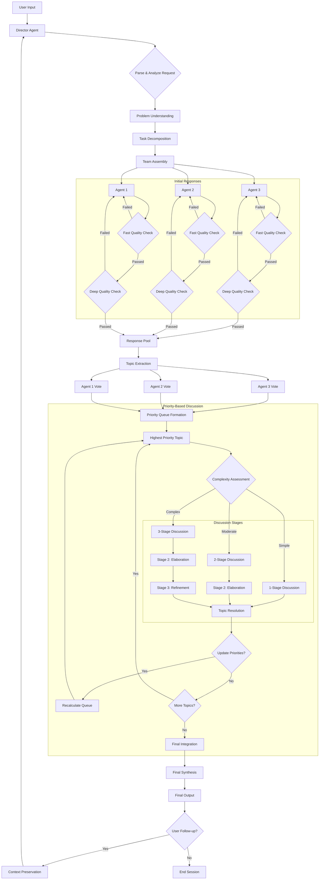

```mermaid
flowchart TD
    A[User Input] --> B[Director Agent]
    B --> C{Parse & Analyze Request}
    C --> D[Problem Understanding]
    D --> E[Task Decomposition]
    E --> F[Team Assembly]

    %% Initial Parallel Response Phase
    F --> G1[Agent 3] & G2[Agent 2] & G3[Agent 1]
    
    subgraph "Initial Responses"
        G1 --> H1F{Fast Quality Check}
        G2 --> H2F{Fast Quality Check}
        G3 --> H3F{Fast Quality Check}
        
        H1F -->|Failed| G1
        H2F -->|Failed| G2
        H3F -->|Failed| G3

        H1F -->|Passed| H1D{Deep Quality Check}
        H2F -->|Passed| H2D{Deep Quality Check}
        H3F -->|Passed| H3D{Deep Quality Check}
        
        H1D -->|Failed| G1
        H2D -->|Failed| G2
        H3D -->|Failed| G3
    end
    
    H1D & H2D & H3D -->|Passed| I[Response Pool]

    %% Voting & Priority System
    I --> J[Topic Extraction]
    J --> K1[Agent 3 Vote] & K2[Agent 2 Vote] & K3[Agent 1 Vote]
    K1 & K2 & K3 --> L[Priority Queue Formation]
    
    %% Progressive Discussion System
    subgraph "Priority-Based Discussion"
        L --> M[Highest Priority Topic]
        
        M --> N{Complexity Assessment}
        N -->|Simple| O1[1-Stage Discussion]
        N -->|Moderate| O2[2-Stage Discussion]
        N -->|Complex| O3[3-Stage Discussion]
        
        subgraph "Discussion Stages"
            O1 --> S
            
            O2 --> P2[Stage 2: Elaboration]
            P2 --> S
            
            O3 --> P3[Stage 2: Elaboration]
            P3 --> Q3[Stage 3: Refinement]
            Q3 --> S
        end
        
        S[Topic Resolution] --> T{Update Priorities?}
        T -->|Yes| U[Recalculate Queue]
        U --> M
        T -->|No| V{More Topics?}
        
        V -->|Yes| M
        V -->|No| W[Final Integration]
    end
    
    W --> X[Final Synthesis]
    X --> Y[Final Output]
    
    Y --> Z{User Follow-up?}
    Z -->|Yes| AA[Context Preservation]
    AA --> B
    Z -->|No| AB[End Session]
```
